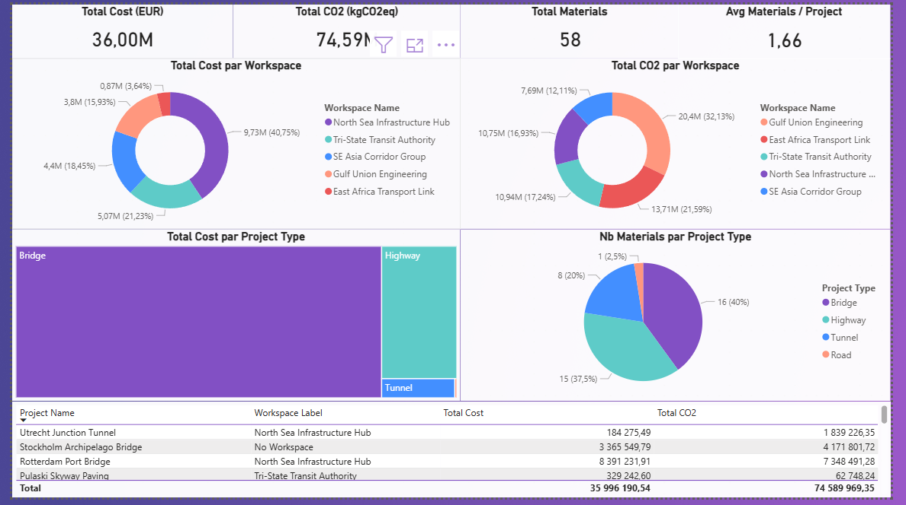

# Sales Performance Dashboard — ORIS Technical Exercise

Power BI dashboard built as part of a recruitment technical exercise.

---

## Overview

This dashboard was designed to track and analyze sales performance across multiple dimensions. It provides business teams with clear, actionable visibility into key commercial indicators.

## Features

- Sales performance tracking by product / region / period
- Dynamic KPI cards with DAX measures
- Time intelligence analysis (YTD, MoM, YoY comparisons)
- Interactive slicers and cross-filtering
- Clean data model with star schema

## Tools Used

| Tool | Usage |
|------|-------|
| Power BI Desktop | Dashboard design and publishing |
| DAX | KPI measures, time intelligence |
| Power Query | Data transformation and cleaning |

## File

| File | Description |
|------|-------------|
| `Omar_Houamel_ORIS_Technical_Exercise.pbix` | Main Power BI file |

## Screenshots

## How to open

1. Download and install [Power BI Desktop](https://powerbi.microsoft.com/desktop)
2. Clone this repo or download the `.pbix` file
3. Open the file in Power BI Desktop

---

**Author:** Omar Houamel
**LinkedIn:** [omar-houamel](https://www.linkedin.com/in/omar-houamel-ba319b226/)
